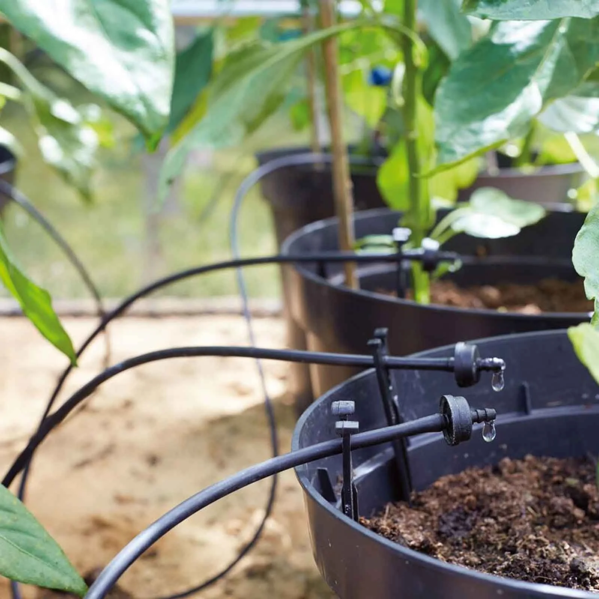

# OUR TOPIC: SPRINKLER IRRIGATION

One of the ways to Solve World Hunger is by increasing Agricultural Output.
As Nexeero Group, our goal is to contribute to the Zero Hunger Project by bringing solutions to some agriculture issues like Irrigation, faced by Least developed countries. 

From that common goal we came to a decision of designing or better some of the devices used in agricultureespecially in micro-irrigation like agriculture sprinklers. We want to look at how we can innovate them in a way that they can be highly effective, easily accessible by the lowly hence helping in bettering LDCs irrigation issues.

