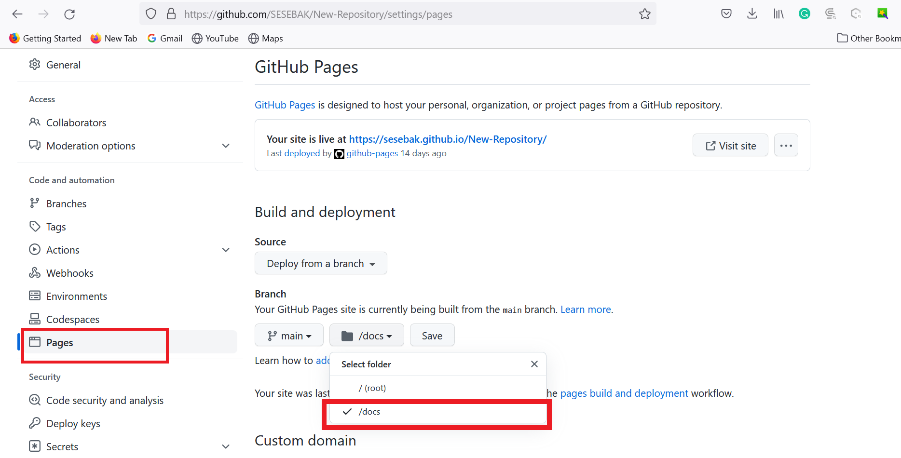

# HOW TO BUILD 

### Step 1: GET THE TOOLS
 Installing all the necessary tools to build the webpage:

    - [Git](https://git-scm.com/downloads); We used git to control our version in gitlab
    - Github; We used github as a servicer for our webpage
    - Github desktop; We used github desktop to transport or push our coding from local to github
    - VScode; We used the visual studio code to write down our documents
    - Nodejs; We used it to build the environment
    - Markdown language; We used the Markdown language to write documents
    - Image upload servive, We used Picgo to storage our image on cloud, in our case in gitlab and used in markdown document,

### Step 2: SET THE PAGE
 Create a repository: go on github.com and after signing up, create your repository. Keep it Public so that anyone on the internet can have access to it and add a README file to it cause that's where you can write a long description for your project. 

 

 NOTE: Open the repository go to settings, pages under branch select the main source to enable Github pages for this repository and under folder select root and save(Attention; you selected root folder because you havn't yet installed a docs folder for this repository, therefore you will have to change this setting later). After saving you will get your repository link.

 

### Step 3: LOCAL SETTINGS

 1. Open Github desktop, clone your repository created earlier on and open it in Visual Studio Code.
 2. In VS Code, Add "Hello" word to the README.md save all and use github desktop to commit and push to the web page.
    We use the Docsify methode to build the structure, under the vscode menu bar open the Terminal option and create a new terminal. Then install doscsify.

 #### 3.  Install docsify
      1. Enter the following command first "npm i docsify-cli -g"

      2. Make sure the position and then initialize environment with "docsify init ./docs"

      3. After successful initialization, you can see several files created in the directory：
        index.html: Entry File.
        README.md: It will be rendered as the homepage content.
        .nojekyll: Is Used to prevent GitHub Pages from ignoring files that begin with an underscore.Preview
        
     4. Enter the following in cmd.exe: docsify serve docs
     
     5. Then open browser to visit http://localhost:3000, you will get a initial website.

 #### 4. Setting up index.html
  <!DOCTYPE html>
     <html lang="en">
     <head>
         <meta charset="UTF-8">
         <title>test1page</title>
     </head>
     <body>
         <nav>
         <a href="https://www.nexmaker.com">nexmaker</a>
         <a href="https://fabacademy.org">fabacademy</a>
         <a href="bobwu0214@gmail.com">conact</a>
         </nav>
         <h1>hello world head1    </h1>
         <h2>hello world head2    </h2>
         <h3>hello world head1    </h3>
         <h4 align="center">hello world head2    </h4>
         <h4 style="background-color:red">This is a heading</h4>
         <b>This text is bold</b>
         <strong>This text is strong</strong>
         
paragraph1

         
paragraph2

         

         
paragraph3

         <a href="www.nexmaker.com">This is a link</a>
         
         

         <li><a href="http://ng.cba.mit.edu">A</a></li> 
         <li><a href="https://www.linkedin.com/in/saveriosilli">B</a></li> 
         <li><a href="https://www.linkedin.com/in/ted-hung-abbb806/">C</a></li> 
         <li><a href="https://www.linkedin.com/in/thunder-zhang-3b4090b">D</a></li> 
         <li><a href="xujunnature@gmail.com">E</a></li> 
     <!--mark,not show anything in web。-->
     </body>
     </html>

 #### 5.  Add sidebar and navbar
     for sidebar 
              <!-- 侧边栏 docs/_sidebar.md -->
               - Team introduce
               - Daily homework
               - [1. PM]()
               - [how to build web](class/1pm/1pm-web.md)
               - introduce team
               - introduce finial project
               - [2. arduino basic]()
               - [3. CAD]()
               - [4. 3D printing]()
               - Final project
               - topic
               - innovation
               - market
               - how to design 
               - how to make
               - SDGs

 #### 6. Write your document and save all the document.

 #### 7. Image Upload
    We created an Image folder in docs where we stored all the pictures and we would drag and drop them into the document.

    

### Step 4: UPLOAD DOCUMENT
    Use github desktop to upload new information by changing the branch's fold from root to docs.

    

 ## REFERENCES 
 - https://docsify.js.org/#/?id=docsify
 - https://blog.csdn.net/Mark_md/article/details/121457115
 - https://docs.github.com/en/pages/getting-started-with-github-pages/about-github-pages
