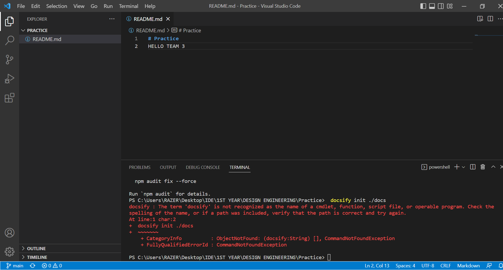
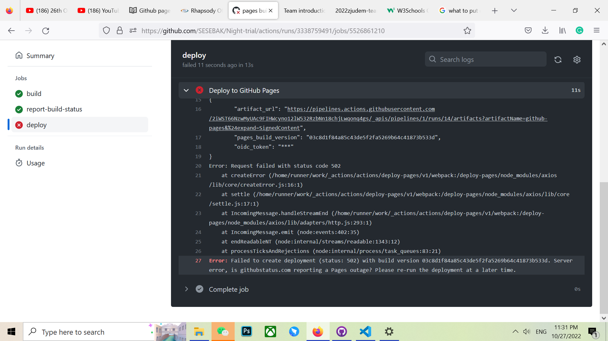

# CHALLENGES ENCOUNTERED

- ### Choosing 'docs' folder 
 When setting up our page we had started by choosing the folder "docs" rather that choosing "root" which after saving was not giving us the webpage link, to later now discover that we had to choose "root" in the first place because we had not yet put the local settings.

 

- ###  The term 'npm' is not recognized as the name of a cmdlet, function, script file, or operable  program
  operable program was:     npm i docsify-cli -g

   and then system would warn

   npm : The term 'npm' is not recognized as the name of a cmdlet, function, script file, or 
   operable program. Check the spelling of the name, or if a path was included, verify that 
   the path is correct and try again.
   At line:1 char:2
   +  npm i docsify-cli -g
   +  ~~~
   + CategoryInfo          : ObjectNotFound: (npm:String) [], CommandNotFoundException        
   + FullyQualifiedErrorId : CommandNotFoundException
    

- ### The term 'docsify' is not recognized as the name of a cmdlet, function, script file, or operable  program
  operable program was:    docsify init ./docs

  and the system would warn
  

  Solution: We had to disinstall and re-install all the tools and the it worked.

  - ### Failed to Deploy
  Sometimes we would push our changes to the page and we would have a notification that deployment has failed. 

  

   The solution is to wait a bit longer and keep trying again.
